# Dive into web-frontend
> Виртуалка - Microsoft Azure

---

## Настройка в терминале(PowerShell)
Подключение к vm по ssh
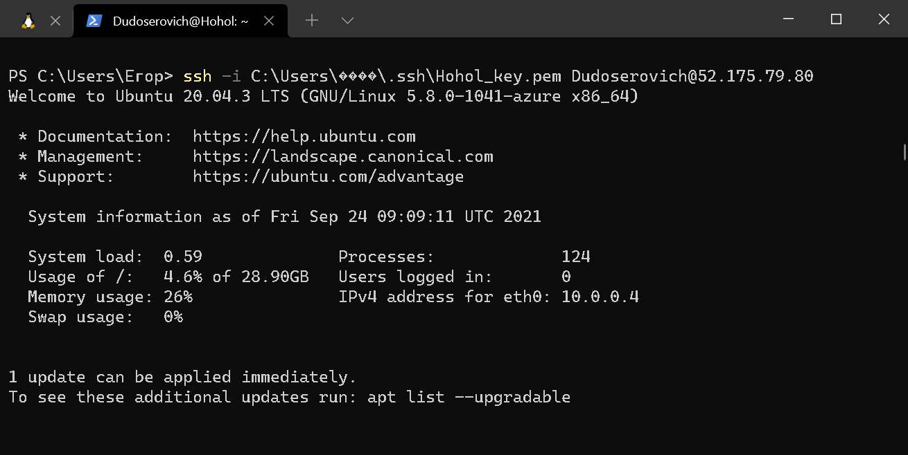
ping гугла
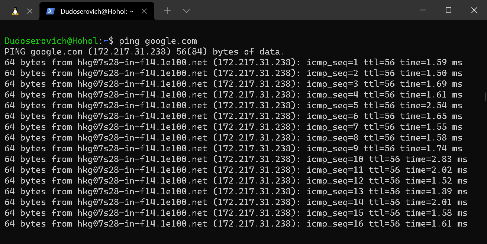
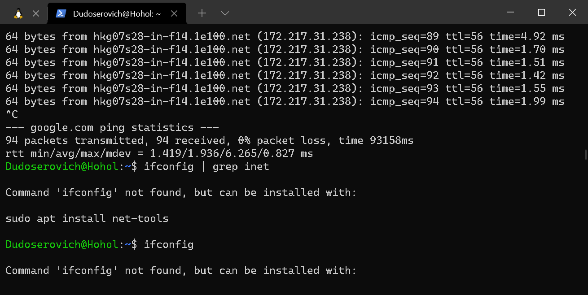
Проверка пинга хоста
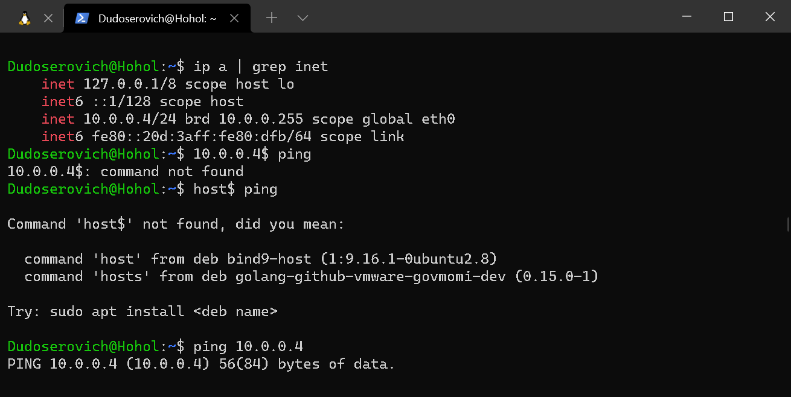
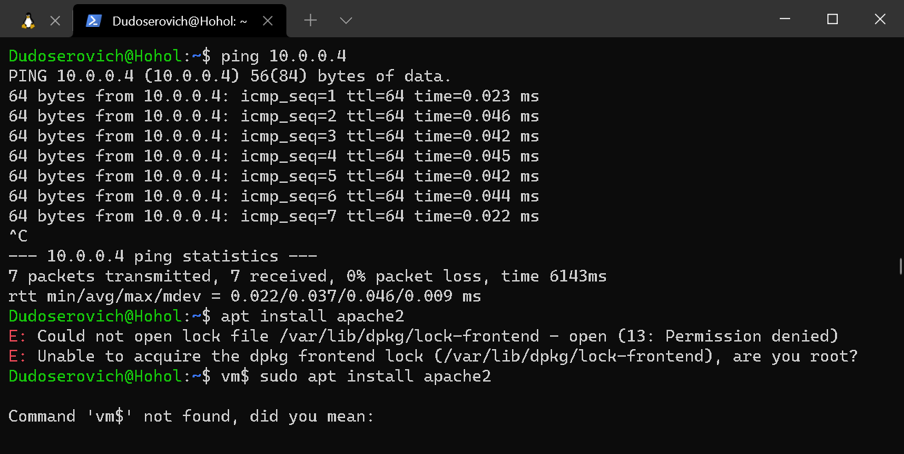
Устанавливаем Web-Server
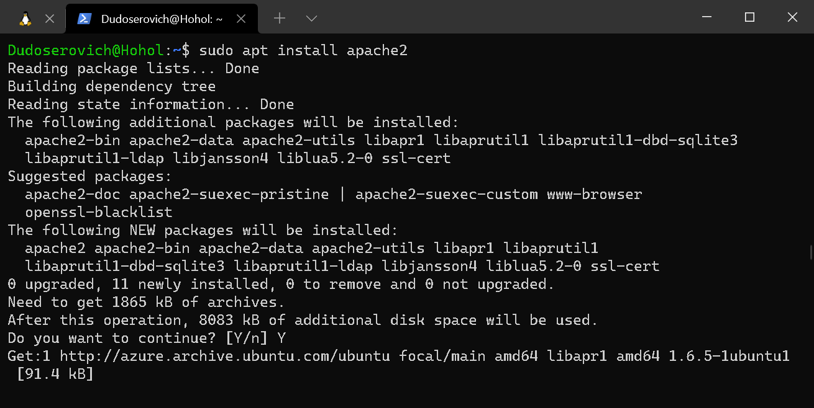
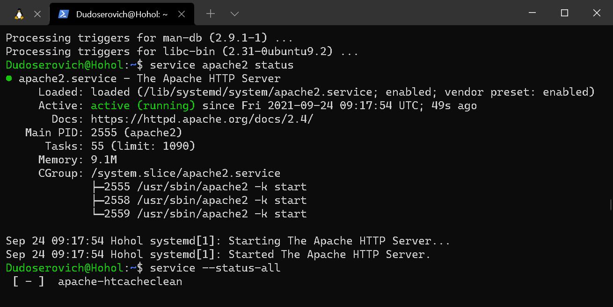
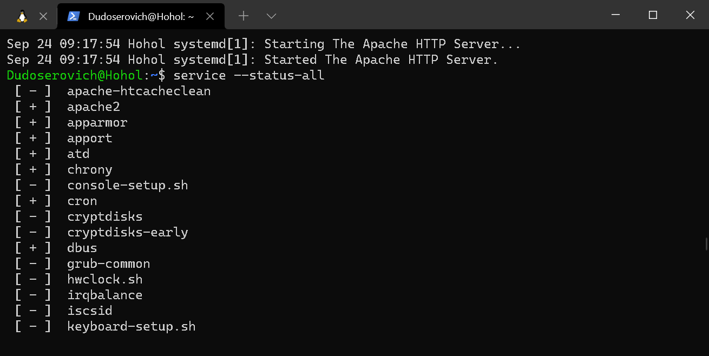
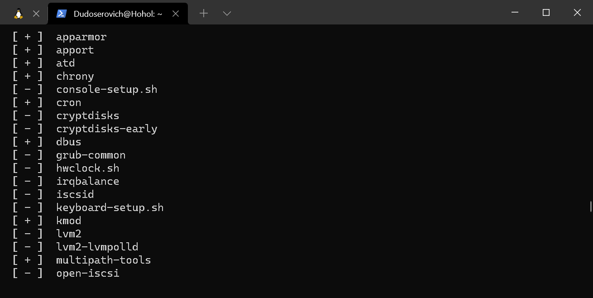
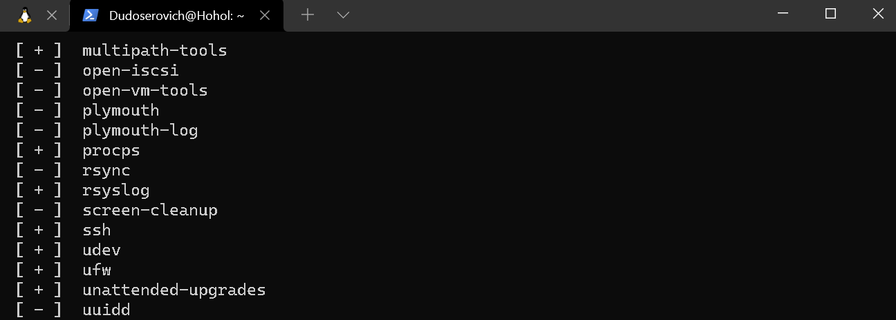
Переписываем *index.html*, устанавливая права доступа и узнаем *КтО я*
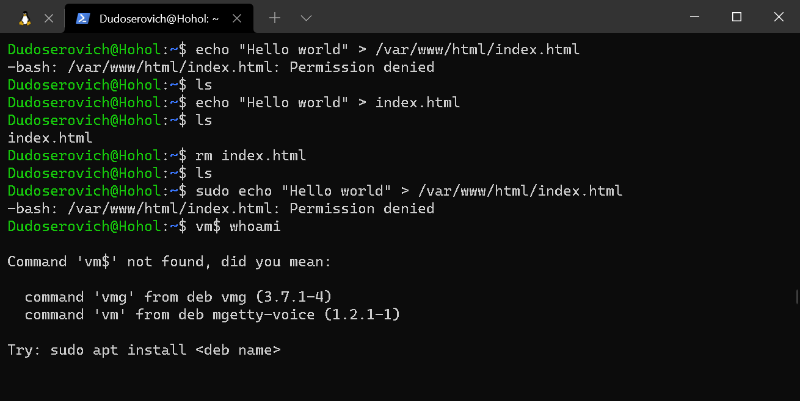
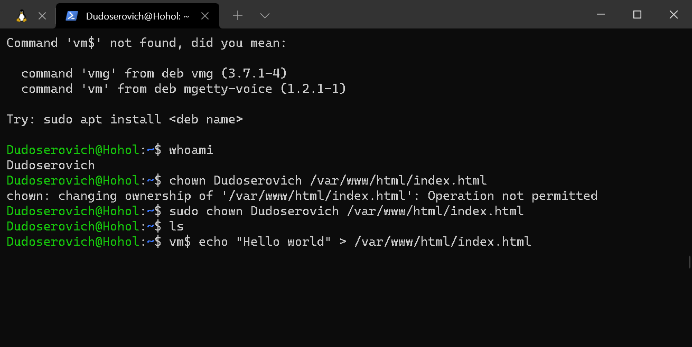
Устанавливаем демона для ssh, но он нам не нужен, так как такой уже есть
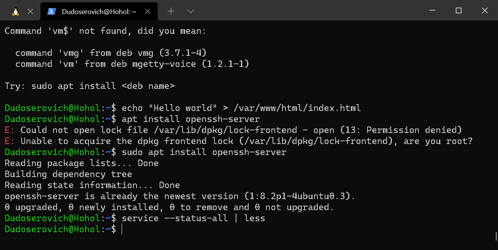

---

## Настройка в WebStorm
Сейчас мы будем уметь редачить на хосте
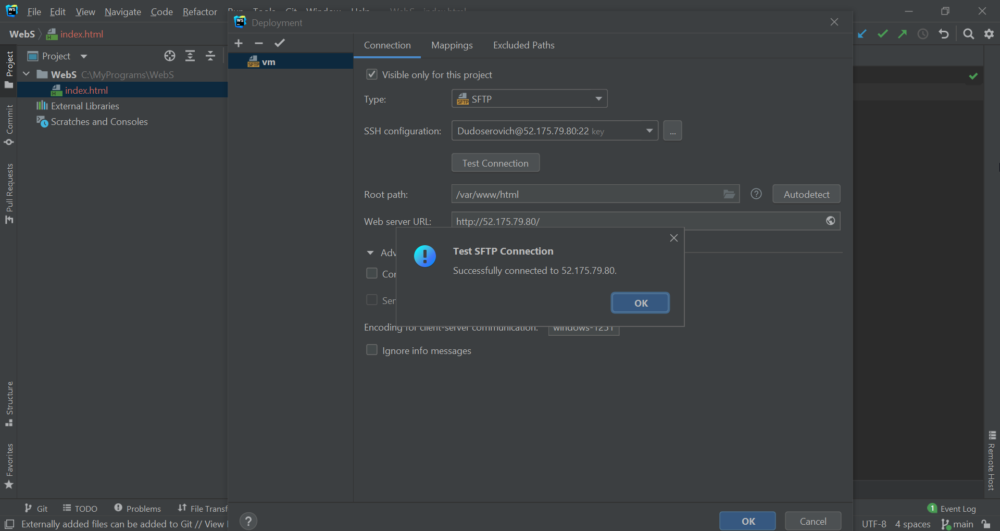
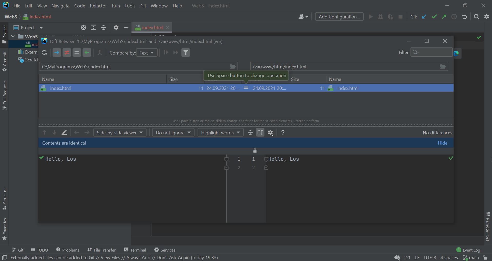
Ну привет (:
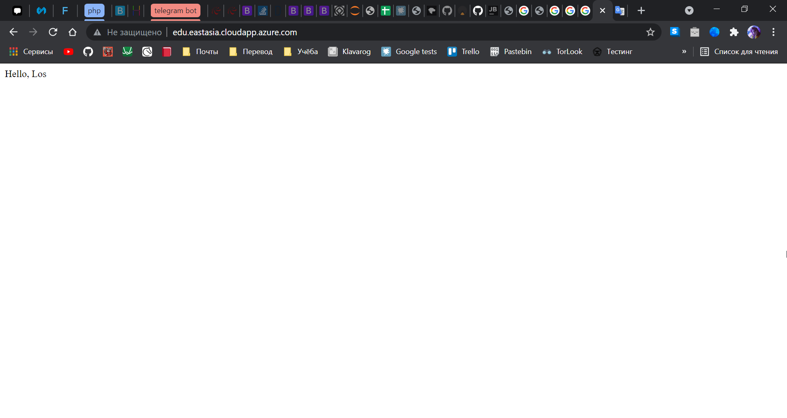
## Теперь можно и отдохнуть
